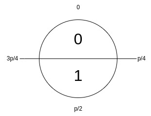

# snakeCTF 2023
## [crypto] Strongest cipher

### Analysis
We are supplied with the code of a cipher, except for the decryption function.
By reading the code, one could notice that it is a simple version of Kyber (one of the post quantum algorithms proposed at the NIST PQ Competition). It is based on lattices and on the problem we have seen in the previous challenge: learning with errors.

Otherwise, it is not so difficult to reverse the encryption function by using the secret key. 

You need to pay attention at the scaling function. During encryption the message is first upscaled:
$$m \rightarrow \frac{p}{2}m$$. This operation centeres the message values at $$\frac{q}{2}$$.

In order to get the original plaintext, you need to downscale your compressed plaintext.
$$c \rightarrow \frac{2}{p}c$$. This operation will center the values at `0`. The obtained values are in $$\ZZ_p$$, so they are not the original bits `0` and `1`. How can we obtain the bits from those values?



But....to decrypt the message we need to find the secret key from the given public key. In the previous challenge we was working in $$\ZZ_p$$, now we are working in the ring $$\ZZ_p/\langle x^8+x^7+x^6+x^5+1\rangle$$.

So...we are working with polynomials of maximum degree equal to `7` and with coefficients belonging to $$\ZZ_p$$.

#### The public key

The public key is composed by the Matrix `A` and the vector `b`:
- `A` has size 2 x 2
- `b` has size 2 x 1

#### The error vector

The error vector `e` has size 2 x 1 and very coefficients in `{0,1}`.

#### Finding the secret vector `s`

Each polynomial has got 8 coefficients. The vector `e` is composed by two polynomials, then we will have to deal with 16 coefficients whose values are `0` or `1`. How many possibilities? $$2^{16}$$

Then, it's straightforward performing an exhaustive search on the error vector. For each possible vector `e'`, we can subtract `e'` from `b` and solve the linear system `A\times s = b - e'`.

How to get the correct vector `s`?
Indeed, we can obtain more than one solution. Therefore, we can simply use the decryption function as an oracle. If the decrypted message (each byte has been encrypted separately) contains the word `snakeCTF`, we just got the correct vector `s`.

#### Finding the flag
Finding the correct vector `s` is equivalent to say that we got the correct `flag`.

### Flag
`snakeCTF{m4yb3_1t5_n07_so_5tr0ng}`

### Code

```python
def decrypt(C, SK, p): 
        u, v = C
        noisy_m = v - SK.transpose()*u

        coefficients = list(noisy_m[0][0])
        target = math.ceil(p/2)
        binary_string = ""
        for c in coefficients:
            if int(c) < int(target):
                if abs(int(target)-int(c)) < int(c):
                    binary_string = "1" + binary_string
                else:
                    binary_string = "0" + binary_string
            elif int(c) > int(target):
                if abs(int(target)-int(c)) <= abs(p-int(c)):
                    binary_string = "1" + binary_string
                else:
                    binary_string = "0" + binary_string
            else:
                binary_string = "1" + binary_string
        
        return int(binary_string[::-1], 2)

q = 65537
Z = Zmod(q)
S = PolynomialRing(Z,'x')
R = S.quotient(x^8+x^7+x^6+x^5+1, 'x')


r = remote(HOST, PORT)
text = r.recvall().decode().replace("^", "**").split("\n")

A = Matrix(R, eval(text[9][4:]))
B = Matrix(R, eval(text[11][4:])).transpose()

ciphertexts = [ ( Matrix(R, eval(text[i])[0]).transpose(), Matrix(R, eval(text[i])[1]).transpose()) for i in range(14, len(text)-1) ]

# exhaustive search
for e_value in range(2**16):
     binary_string = bin(e_value)[2:].zfill(16)
     e = [ [int(i) for i in binary_string[:8]], [int(i) for i in binary_string[8:]]  ]
          
     e_new = []
     eq0 = 0
     for i, esp in enumerate(e[0]):
          eq0 += esp*x^(i)
     eq1 = 0
     for i, esp in enumerate(e[1]):
          eq1 += esp*x^(i)
     e_new.append(eq0)
     e_new.append(eq1)

     E = Matrix(R, e_new).transpose()
    
     possible_SK = (A.solve_right(B-E))
     plaintext = ""
     for couple in ciphertexts:
          plaintext += chr(decrypt(couple, possible_SK, q))
     if "snakeCTF" in plaintext:
          print(plaintext)
          break
```