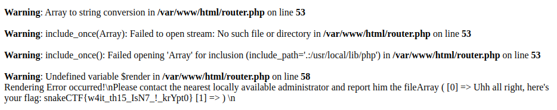

# Phpotato [_snakeCTF 2023_]

**Category**: web

## Description

Dear crypto bro,
I know you're sad the dogecoin is doing bad.
I made this app so we can share our favorite numbers and crunch them together.

## Solution

In the index is defined a hook (something that can be executed if registered) showing the flag:
```
register_new_user_hook('show_flag', $display_popup,
    ["Uhh all right, here's your flag: " . FLAG, &$message]);
```

We can register and login with a new account, but soon we notice that we can't do much without being admin.

By reading the code we find an endpoint vulnerable to SQLi:

```
$handle_get = fn(&$mysqli, &$account_numbers) =>
    ($query = "SELECT * FROM numbers WHERE user_id = " . $_SESSION['id']) &&
    (isset($_GET['sort']) ?
    ($query .= " ORDER BY processed_date " . $_GET['sort'])
    : true
) &&
    (isset($_GET['limit']) ?
    ($query .= " LIMIT " . $_GET['limit'])
    : true
) &&
    ($query_result = $mysqli->query($query)) &&
    ($res = $query_result->fetch_all(MYSQLI_ASSOC)) &&
    ($account_numbers = implode(array_map($render_number, $res))
);
```

We just have to understand how to control one of the parameters to exploit it.
Let's read how the URL is rewritten in the `.htaccess`:

```
php_flag register_globals off

RewriteEngine on
RewriteBase /

RewriteRule ^/?$                                                        /index.php?page=home                                [L]


RewriteRule ^(home|login|register|admin)$                               /index.php?page=$1                                  [NC,L]

RewriteRule ^(home|admin)/sort-(asc|desc)/?$                            /index.php?page=$1\&sort=$3                         [NC,L]
RewriteRule ^(home|admin)/sort-(asc|desc)/limit-([^/]+)/?$              /index.php?page=$1\&sort=$3\&limit=$4               [NC,L]

RewriteRule ^(home|admin)/p-([^/]+)/?$                                  /index.php?page=$1\&precision=$2                    [NC,L]
RewriteRule ^(home|admin)/p-([^/]+)/sort-(asc|desc)/?$                  /index.php?page=$1\&precision=$2\&sort=$3           [NC,L]
RewriteRule ^(home|admin)/p-([^/]+)/sort-(asc|desc)/limit-([^/]+)/?$    /index.php?page=$1\&precision=$2\&sort=$3\&limit=$4 [NC,L]

RewriteRule ^(home|login|register|admin)\.php$ -                                                                            [NC,F,L]%   
```

We notice that `sort` can only assume the values `asc` or `desc`, but the regex for the parameter `p` is way too permissive, allowing us to insert anything in it and abuse the URL rewriting to inject the `sort` parameter with whatever we want!
To exploit the rewriting we build the url like `/home/p-<payload url encoded>`, where the payload is `8&sort=asc,<sqli>`.

By injecting the sort parameter with the payload 
```(SELECT ( CASE WHEN EXISTS (
    SELECT password FROM users WHERE username='admin' AND password REGEXP BINARY '{regex}'
    ) THEN sleep({SLEEP_TIME}) ELSE num END ))
```
to perform a time-based SQLi and retrieve the admin password.

We can now log in as admin.
In the admin page we can create pipelines and execute them to process numbers. 
The functions make use of `user_hooks` to execute the processing:

```
$handle_post_process = fn(&$mysqli) =>
($stmt = $mysqli->prepare('SELECT id, num, pipeline FROM numbers WHERE user_id = ? AND id = ?')) &&
$stmt->bind_param("ii", $_SESSION['id'], $_POST['id']) &&
$stmt->bind_result($id, $num, $pipeline) &&
(
    ($res = $stmt->execute()) &&
    $stmt->fetch() &&
    ($pipeline_e = explode("\n", $pipeline)) &&
    ($_SESSION['pipeline']['instructions'] = array_map($parse_instruction, $pipeline_e)) &&
    (($_SESSION['pipeline']['num'] = $parse_number($num)) || $_SESSION['pipeline']['num'] == 0) &&
    ($_SESSION['pipeline']['id'] = $id) ?
    set_user_hook('start_processing')
    : set_user_hook('something_wrong')
) || header('Refresh:0') || exit();
```

This function parse all the instructors via `parse_instruction`, parse the number via `parse_number` and set a hook to process it on the next page load.

Let's check the two functions:

```
$define_math_constants = fn() =>
define('PI', 3) &&
define('E', 3) &&
define('g', 9);

$instructions = [
    '=' => fn(&$lval, $rval) => $lval = $rval,
    '+=' => fn(&$lval, $rval) => $lval = $lval + $rval,
    '-=' => fn(&$lval, $rval) => $lval = $lval - $rval,
    '*=' => fn(&$lval, $rval) => $lval = $lval * $rval,
    '/=' => fn(&$lval, $rval) => $lval = $lval / $rval,
    '_' => fn(&$lval, $rval) => $lval = $lval,
];

$check_lval = fn($lval) => $lval[0] == '$' && ctype_graph(substr($lval, 1));

$check_rval = fn($rval) => $check_lval($rval) || ctype_digit($rval) || ctype_alpha($rval);

// Instruction as quadruple
// (name, [lval, rval], deps, deref_rval)
$parse_instruction = fn($i) =>
    (strlen($i) == 0 || ($i[0] == '#') ? // Comments
    []
    : (
        // Remove whitespaces
        ($i = preg_replace('/\s\s+/', ' ', $i)) &&
        ($i = trim($i)) &&
        (strpos($i, "FLAG") === false) &&
        // Explode Instruction
        ($instr_splitted = explode(" ", $i, 3)) &&
        // Parse
        (count($instr_splitted) == 3) &&
        ([$lval, $op, $rval] = $instr_splitted) &&
        $check_lval($lval) &&
        // Remove reference
        ($lval = substr($lval, 1)) &&
        $check_rval($rval) &&
        array_key_exists($op, $instructions) ?
        // Instruction is ok, check if deref is needed
        (
            ctype_digit($rval) ||
            ctype_alpha($rval) ||
            // Remove leading $
            (($rval = substr($rval, 1)) && false) ?
            [$op, [$lval, $rval], [$lval], false]
            : [$op, [$lval, $rval], [$lval, $rval], true]
        )
        : []// Instruction not found
    )
);

$parse_number = fn($num) =>
    (
    $num != '' &&
    ($num = trim($num)) &&
    ctype_digit($num) ?
    intval($num)
    : (defined($num) && $num != "FLAG" ?
        constant($num)
        : 0
    )
```
The first function checks that the instruction is allowed:
- `FLAG` must not be inside
- it must be defined in the array (so only `=`, `+=`, etc are allowed)
- lval must be a variable (starting with `$`) and create visible output
- rval can be any lval, a digit or an alphabetic character

The second function parses the starting number, it can be
- empty, so it's 0
- a number
- a constant, but not `FLAG`

Moreover there's another function which is responsible to execute the pipeline:

```
$execute_pipeline = function (&$mysqli) {
    global $constants;
    global $instructions;
    $pipeline = $_SESSION['pipeline'];

    try {
        global $x;
        $x = $pipeline['num'];
        foreach ($pipeline['instructions'] as $instr) {

            if ($instr == []) {
                continue;
            }

            [$op, $args, $deps, $deref] = $instr;

            // Fix scoping
            foreach ($deps as $d) {
                global ${$d};
                if (!isset($$d)) {
                    $$d = 0;
                }

            }
            [$lval, $rval] = $args;

            // Constants
            if (!$deref && ctype_alpha($rval)) {
                $rval = constant($rval);
            }

            if ($deref) {
                $rval = $$rval;
            }
            $instructions[$op]($$lval, $rval);
        }
        $stmt = $mysqli->prepare('UPDATE numbers SET num = ?, processed = 1, processed_date = NOW() WHERE id = ?');
        $stmt->bind_param("si", $x, $pipeline['id']);
        $res = $stmt->execute();
        set_user_hook('pipeline_success');
    } catch (Exception $e) {
        set_user_hook('pipeline_failure');
    } catch (Error $e) {
        set_user_hook('pipeline_failure');
    }
};
```

We notice some weird thing going on here (on top of all the weird stuff obviously): it is taking the definition of each variable from the global scope (via `global ${$d};`).  This means we can overwrite every variable which is available in the code.

The router basically works by using a multidimensional array `$pages`, with keys `$page_name` and `$page_method`, to store the file that have to be included to render the page.

By reading the code responsible for routing the pages we notice something that will be useful:

```
$route = function () use (&$pages) {
    global $globals;
    global $pages;
    global $req_page;
    global $req_method;

    // Include all globals variable which are registered
    foreach ($globals as $var) {
        global $$var;
    }

    // Execute routing function
    try {
        if (array_key_exists($req_page, $pages) && array_key_exists($req_method, $pages[$req_page])) {
            include_once $pages[$req_page][$req_method];
        } else {
            include_once $pages['404'];
        }
        // Render result
        $render();
    } catch (Error $e) {
        http_response_code(500);
        print('Rendering Error occurred!\n' .
            'Please contact the nearest locally available administrator and report him the file' .
            print_r($pages[$req_page][$req_method], true) . '\n');
    }
};
```

So, if we can make the router crash, we can print the variable `$pages[$req_page][$req_method]`. Since we can overwrite any variable with the pipeline:
- set `$pages` to be `$user_hooks`, where the `show_flag` hook is defined
- set `$req_page` to be `$precision`, so we can inject anything we want since `$precision` is taken from the url parameter (we will inject `show_flag`, since it's the hook we're interested)
```
$precision = 0;
$set_default_precision = fn(&$precision) =>
    (isset($_GET['precision']) ?
    ($precision = $_GET['precision'])
    : ($precision = DEFAULT_PRECISION)
);
```
- set `$req_method` to be `1`, so we can include its args, which means the string printing the flag.
- trigger an error by executing it since the `render` method is not imported

To obtain the flag 
1. we create the pipeline with the payload
    ```
    $pages = $user_hooks
    $req_page = $precision
    $req_method = 1
    ```
2. start its processing by clicking process
3. block the request to the page `/admin`
4. process it in the page `/admin/p-show_flag/`




