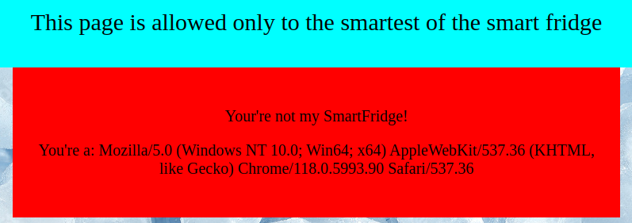
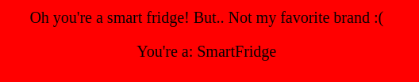
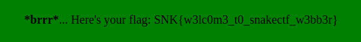

# SmartestFridge

## Description

I love my smart fridge so much.

## Solution

The challenge presents itself as an online website that greets us with a message:

We can immediately recognize the string as our [user agent](https://developer.mozilla.org/en-US/docs/Web/HTTP/Headers/User-Agent). Using [burp](https://portswigger.net/burp), we can edit and resend the request changing the user agent.

Since the application asks states "This page is allowed only to the smartest of the smart fridge", followed by "You're not my SmartFridge!", let's try to change it to `smartfridge`. Doing so, we get the response:

This answer confirms that we are on the right path. We need now to find the brand of the smart fridge. By looking at the page source we notice that an image is set as page icon: `<link rel="icon" type="image/x-icon" href="/pictures/huahei.png">`. Looking at the filename and the logo, we recognize the brand as a misspelled `huawei`.
By repeating the request with the user agent `smartfridge huawei` we get the flag:

