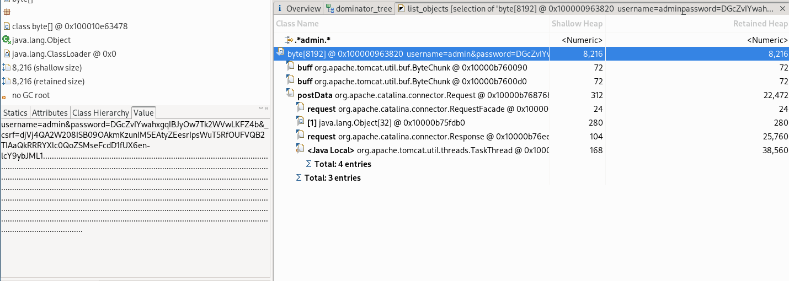

# Springbrut

## Description

The app our new intern made must have some issues, because I saw him checking some weird numbers... Can you figure it out?

## Solution

By opening the website we get a redirected to the login screen. 
The source code (in `springbrut/src/main/java/com/springbrut/springbrut/controller/AuthController.java`) shows where we can find the flag:

```java
@Controller
@RequestMapping("/auth")
public class AuthController {
  @GetMapping("/helloworld")
  public String salutavaSempre() {
    return "status";
  }
  @GetMapping("/flag")
  public ResponseEntity<String> flaggavaSempre() {
    File f = new File("/flag");
    String flag;
    try {
      InputStream in = new FileInputStream(f);
      flag = new String(in.readAllBytes());
    } catch (Exception e) {
      flag = "PLACEHOLDER";
    }
    return new ResponseEntity<String>(flag, HttpStatus.OK);
  }
}
```

The flag is located at the endpoint `/auth/flag`, but this path is secured behind the login page, as stated in `springbrut/src/main/java/com/springbrut/springbrut/config/SecurityConfig.java`:
```java
@Bean
public SecurityFilterChain filterChain(HttpSecurity http) throws Exception {
  http.authorizeHttpRequests(
          req -> req.requestMatchers("/auth/**").authenticated())
      .authorizeHttpRequests(x -> x.anyRequest().permitAll())
      .formLogin(f
                 -> f.failureHandler(authenticationFailureHandler())
                        .successHandler(authenticationSuccessHandler()));
  return http.build();
}
```

So we need a way to log in. By looking at the schema we can see that there's only one account that can log into the page:
`INSERT INTO users(username, password) VALUES ('admin','$2a$10$kv/6o0GpjU.pTcd0cnJKC.C6q.1/3ocmULkpl3JoYWKwj/k1wf4ie');`

And we can see that there's a bot checking in every minute.
In the template `status.html`, we see a page with a web worker which makes requests at some endpoints not specified in the code. Those requests are in fact part of the [spring boot actuators](https://www.baeldung.com/spring-boot-actuators):
```js
const setMetric = (name) => {
  fetch(`/actuator/metrics/${name}`).then(res => res.json()).then(json => {
    console.log({json});
    self.postMessage({name, value: json.measurements[0].value});
  });
};
const updateAll = () => {
  console.log('updating...');
  setMetric('disk.free');
  setMetric('http.server.requests');
  setMetric('process.cpu.usage');
  setMetric('system.load.average.1m');
  setMetric('process.uptime');
};
updateAll();
setInterval(updateAll, 1000);
```
```html
<p>Here's the status of the app:</p>
<p>Disk free: <span id="disk.free"></span></p>
<p>Requests: <span id="http.server.requests"></span></p>
<p>CPU: <span id="process.cpu.usage"></span></p>
<p>Process uptime: <span id="process.uptime"></span></p>
<p>Load average (1m): <span id="system.load.average.1m"></span></p>
<script>
    const w = new Worker("/js/worker.js");
    w.onmessage = (event) => {
        field = event.data.name;
        tag = window.document.getElementById(field);
        tag.innerText = event.data.value;
    }
</script>
```

We can confirm that the actuators are imported by looking at the `pom.xml` file:
```pom.xml
<dependency>
    <groupId>org.springframework.boot</groupId>
    <artifactId>spring-boot-starter-actuator</artifactId>
</dependency>
```

So, to check which actuators are enabled, we look into the `application.properties`, where we can find `management.endpoints.web.exposure.include=*`.
This implies that all actuators are active, which includes the actuator `heapdump`. By making a request to the path `/actuator/heapdump` we can in fact download it.

To read it, we use the program [Memory analyzer](https://eclipse.dev/mat/downloads.php) from `Eclipse`. With the program we can parse the dump and start looking around.

By opening the dominator tree, we can use the functionality `regex` to search for any string in the memory. When we enter `admin`, we immediately find the login requests made by the bot, and by clicking "List objects > with incoming references" we have the confirmation of that.

In the `body` of the request we can see the password:



By logging in as admin and going to `/auth/flag` we get the flag: `SNK{N0_m3morY_L3akS???}`.

(The credentials can also be found using the command `strings` and a regex)
